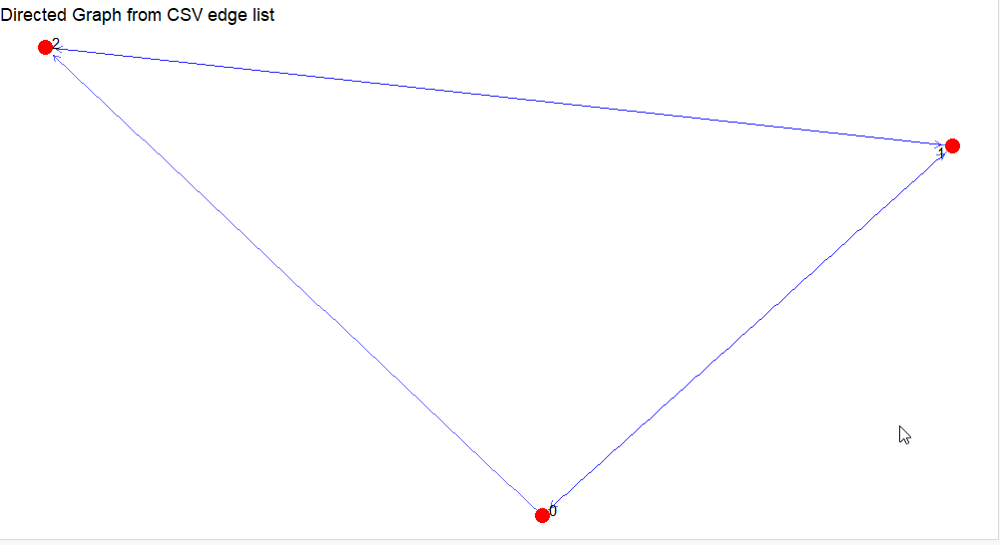
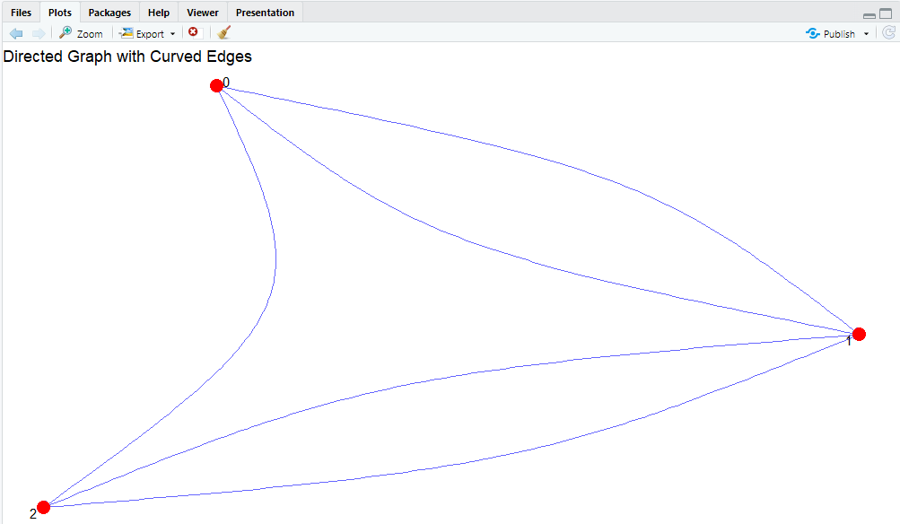
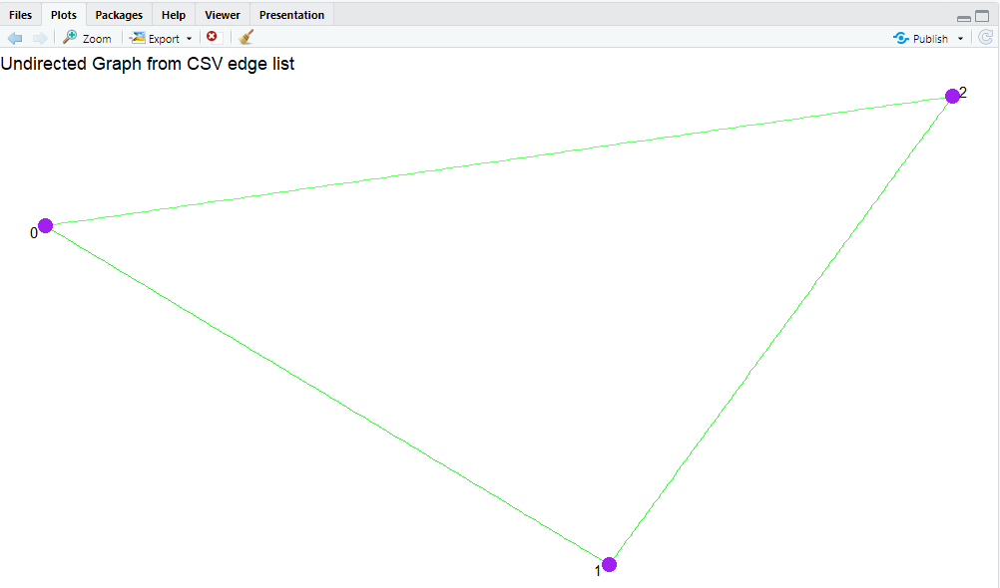

# Graph Visualization and Analysis Project
## Table of Contents
1. [Overview](#overview)
2. [Java Code](#java-code)
    - [1. Graph Class Definition](#1-graph-class-definition)
    - [2. Methods for Adding and Removing Vertices and Edges](#2-methods-for-adding-and-removing-vertices-and-edges)
    - [3. Exporting the Graph to CSV](#3-exporting-the-graph-to-csv)
    - [4. Graph Example and Execution](#4-graph-example-and-execution)
3. [R Code](#r-code)
    - [1. Loading Necessary Libraries](#1-loading-necessary-libraries)
    - [2. Reading the CSV and Creating Graphs](#2-reading-the-csv-and-creating-graphs)
    - [3. Hamiltonian and Eulerian Path/Cycle Checks](#3-hamiltonian-and-eulerian-pathcycle-checks)
    - [4. Running the Analysis](#4-running-the-analysis)
    - [5. Visualizing the Graphs](#5-visualizing-the-graphs)
4. [Full Code for Java](#full-code-for-java)
5. [Full Code for R](#full-code-for-r)


## Overview
This project demonstrates how to create and analyze graphs using Java for data structure construction and R for visualization and analysis. Java code handles graph construction, while R handles the visualization and analysis, such as checking for Hamiltonian and Eulerian paths and cycles.

---

## Java Code

### 1. **Graph Class Definition**
The Graph class defines the graph data structure using an adjacency list. Each vertex is mapped to a list of its neighboring vertices.

```java
import java.io.BufferedWriter;
import java.io.FileWriter;
import java.io.IOException;
import java.util.*;

public class Graph {
    private Map<Integer, List<Integer>> adjacencyList;

    public Graph() {
        adjacencyList = new HashMap<>();
    }
}
```

**Explanation:**
- A `Map<Integer, List<Integer>>` is used to represent the graph, where each vertex is an integer, and its adjacent vertices are stored in a `List<Integer>`.
- The constructor initializes the adjacency list.

---

### 2. **Methods for Adding and Removing Vertices and Edges**
These methods allow adding and removing vertices and edges, both directed and undirected.

```java
public void addVertex(int vertex) {
    adjacencyList.putIfAbsent(vertex, new ArrayList<>());
}

public void addEdge(int source, int destination) {
    addEdge(source, destination, false); // Default: Directed Graph
}

public void addEdge(int source, int destination, boolean isUndirected) {
    adjacencyList.putIfAbsent(source, new ArrayList<>());
    adjacencyList.putIfAbsent(destination, new ArrayList<>());

    if (!adjacencyList.get(source).contains(destination)) {
        adjacencyList.get(source).add(destination);
    }
    if (isUndirected && !adjacencyList.get(destination).contains(source)) {
        adjacencyList.get(destination).add(source);
    }
}

public void removeVertex(int vertex) {
    if (!adjacencyList.containsKey(vertex)) return;
    adjacencyList.remove(vertex);

    for (List<Integer> neighbors : adjacencyList.values()) {
        neighbors.remove(Integer.valueOf(vertex));
    }
}

public void removeEdge(int source, int destination, boolean isUndirected) {
    if (adjacencyList.containsKey(source) && adjacencyList.get(source).contains(destination)) {
        adjacencyList.get(source).remove(Integer.valueOf(destination));
    }
    if (isUndirected && adjacencyList.containsKey(destination) && adjacencyList.get(destination).contains(source)) {
        adjacencyList.get(destination).remove(Integer.valueOf(source));
    }
}
```

**Explanation:**
- `addVertex()`: Adds a new vertex if it doesn’t already exist.
- `addEdge()`: Adds an edge between the source and destination. Supports both directed and undirected edges.
- `removeVertex()` and `removeEdge()`: Remove vertices and edges respectively, ensuring the integrity of the graph.

---

### 3. **Exporting the Graph to CSV**
This method allows exporting the graph’s edge list to a CSV file for later analysis in R.

```java
public void exportEdgeList(String filename) {
    try (BufferedWriter writer = new BufferedWriter(new FileWriter(filename))) {
        for (Map.Entry<Integer, List<Integer>> entry : adjacencyList.entrySet()) {
            for (Integer neighbor : entry.getValue()) {
                writer.write(entry.getKey() + "," + neighbor);
                writer.newLine();
            }
        }
        System.out.println("Edge list exported to " + filename);
    } catch (IOException e) {
        e.printStackTrace();
    }
}
```

**Explanation:**
- This method writes the edges of the graph to a CSV file, with each edge represented as a pair of integers (source, destination).

---

### 4. **Graph Example and Execution**
This part demonstrates how to create a graph, add vertices and edges, and export the graph data.

```java
public static void main(String[] args) {
    Graph graph1 = new Graph();

    graph1.addVertex(0);
    graph1.addVertex(1);
    graph1.addVertex(2);
    graph1.addEdge(0, 1, true); // Undirected Edge
    graph1.addEdge(0, 2);
    graph1.addEdge(1, 2, true);

    System.out.println("Graph: ");
    graph1.exportEdgeList("graph1.csv");
    graph1.printGraph();

    Graph graph2 = new Graph();

    graph2.addVertex(0);
    graph2.addVertex(1);
    graph2.addVertex(2);

    graph2.addEdge(0, 0, true);
    graph2.addEdge(0, 1, true);
    graph2.addEdge(2, 1, false);
    graph2.addEdge(2, 1, false);
    System.out.println("Graph 2: ");
    graph2.exportEdgeList("graph2.csv");
    graph2.printGraph();
}
```

**Explanation:**
- Creates two graphs and adds vertices and edges.
- Exports the graph data to CSV files for further analysis in R.
- Prints the graph structure for visual inspection.

---

## R Code

### 1. **Loading Necessary Libraries**
This code loads the required libraries for graph visualization and analysis using igraph and ggraph.

```r
# Install necessary libraries (if not already installed)
install.packages("igraph")
install.packages("ggraph")
install.packages("ggplot2")

# Load necessary libraries
library(igraph)
library(ggraph)
library(ggplot2)
```

**Explanation:**
- `igraph`: A powerful library for graph manipulation and analysis.
- `ggraph`: For graph visualization using ggplot2 syntax.

---

### 2. **Reading the CSV and Creating Graphs**
This code reads the CSV file containing the graph data and constructs both directed and undirected graphs using igraph.

```r
# Read the graph data from CSV
graph_data <- read.csv("graph1.csv", header = FALSE, col.names = c("V1", "V2"))

# Check the graph data
print("Original graph data:")
print(graph_data)

# Remove duplicate edges (if any)
graph_data <- unique(graph_data)

# Create directed and undirected graphs using igraph
d_graph <- graph_from_data_frame(graph_data, directed = TRUE)
ud_graph <- graph_from_data_frame(graph_data, directed = FALSE)

# Print graph summary to verify
print("Directed graph summary:")
print(summary(d_graph))

print("Undirected graph summary:")
print(summary(ud_graph))
```

**Explanation:**
- Reads the CSV file that contains the edge list.
- Constructs both directed and undirected graphs using `graph_from_data_frame()` from the igraph package.
- Removes duplicate edges and prints a summary of the graphs.

---

### 3. **Hamiltonian and Eulerian Path/Cycle Checks**
The following functions check whether a graph contains Hamiltonian and Eulerian paths and cycles.

```r
has_hamiltonian_path <- function(graph) {
    n <- vcount(graph)  # Number of vertices
    vertices <- V(graph)  # List of vertices
    
    # Backtracking function to find Hamiltonian path
    find_hamiltonian_path <- function(path) {
        if (length(path) == n) {
            return(TRUE)  # Hamiltonian path found
        }
        last_vertex <- tail(path, 1)
        for (neighbor in neighbors(graph, last_vertex)) {
            if (!(neighbor %in% path)) {
                if (find_hamiltonian_path(c(path, neighbor))) {
                    return(TRUE)
                }
            }
        }
        return(FALSE)
    }
    
    # Try starting from each vertex
    for (start_vertex in vertices) {
        if (find_hamiltonian_path(start_vertex)) {
            return(TRUE)
        }
    }
    return(FALSE)
}
```

**Explanation:**
- Recursive functions check if a Hamiltonian path/cycle exists by exploring each vertex and checking all possible paths.
- Checks the conditions for Eulerian paths and cycles based on the graph’s degree.

---

### 3. **Running the Analysis**
This code runs the checks for both Hamiltonian and Eulerian paths and cycles for the directed graph.

```r
# Check for Hamiltonian and Eulerian properties in the directed graph
print("Checking directed graph:")
cat("Hamiltonian path exists:", has_hamiltonian_path(d_graph), "\n")
cat("Hamiltonian cycle exists:", has_hamiltonian_cycle(d_graph), "\n")

print("Checking directed graph:")
cat("Eulerian path exists:", has_eulerian_path(d_graph, directed = TRUE), "\n")
cat("Eulerian cycle exists:", has_eulerian_cycle(d_graph, directed = TRUE), "\n")
```

**Explanation:**
- The functions are called on the directed graph to check if Hamiltonian or Eulerian paths and cycles exist, and the results are printed.

---
### 4. **Visualizing the Graphs**

In this section, we generate and visualize the directed and undirected graphs using the `ggraph` package in R.

## 1. **Directed Graph with Arrows**

We visualize the directed graph using the **Fruchterman-Reingold layout**, which is a force-directed layout for graph visualization. The graph edges are drawn with arrows, representing the direction of relationships between nodes. Here's the code for this visualization:

```r
ggraph(d_graph, layout = "fr") +  # Use Fruchterman-Reingold layout for force-directed graph
  geom_edge_link(
    color = "blue",
    alpha = 0.6,   # Edge transparency
    arrow = arrow(length = unit(2, "mm")),  # Add arrows to edges
    end_cap = circle(3, "mm")  # Adjust arrowhead size
  ) +
  geom_node_point(size = 5, color = "red") +  # Customize node appearance
  geom_node_text(aes(label = name), repel = TRUE, size = 4) +  # Add node labels with repulsion to avoid overlap
  theme_void() +  # Remove axis and background for a clean graph
  ggtitle("Directed Graph from CSV edge list")  # Set graph title
```
**Explanation:**
- Arrowheads: Arrows are added to indicate the direction of the edges.
- Node appearance: Nodes are displayed as red points with labels.
- Transparency: The edges have a semi-transparent blue color for better visibility of the node structure.

Image of the Directed Graph with Arrows:


## 2. **Directed Graph with Curved Edges**

For a smoother visualization, we use curved edges in the graph. This makes the graph appear cleaner and less cluttered. Here's the code for this visualization:

```r
ggraph(d_graph, layout = "fr") +
  geom_edge_arc(
    arrow = arrow(length = unit(2, "mm")),
    color = "blue",
    alpha = 0.6,
    curvature = 0.2  # Adjust curvature for smoother edges
  ) +
  geom_node_point(size = 5, color = "red") +
  geom_node_text(aes(label = name), repel = TRUE, size = 4) +
  theme_void() +
  ggtitle("Directed Graph with Curved Edges")

```

**Explanation:**
- Curved edges: The edges are drawn with a slight curvature, making the graph look less angular.
- Arrowheads: As before, arrows are used to indicate the direction.
- Node and label customization: Nodes are red with labels to identify them.
Image of the Directed Graph with Curved Edges:


## 3. **Undirected Graph**
Finally, we visualize the undirected graph using the same Fruchterman-Reingold layout. Since the graph is undirected, the edges do not have arrows. Here's the code for this visualization:

```r
ggraph(ud_graph, layout = "fr") +  # Fruchterman-Reingold layout
  geom_edge_link(color = "green", alpha = 0.6) +  # Customize edges
  geom_node_point(size = 5, color = "purple") +  # Customize node colors
  geom_node_text(aes(label = name), repel = TRUE, size = 4) +  # Add node labels
  theme_void() +  # Remove background and axes for cleaner look
  ggtitle("Undirected Graph from CSV edge list")  # Set graph title
```

**Explanation:**
- Undirected edges: The edges do not have direction, which is typical for undirected graphs.
- Node appearance: Nodes are shown in purple, and their names are labeled for clarity.



---

## Full Code for Java
```java
import java.io.BufferedWriter;
import java.io.FileWriter;
import java.io.IOException;
import java.util.*;

/**
 * A class representing a Graph using an adjacency list.
 * Supports adding and removing vertices, adding and removing edges,
 * and exporting the graph structure to a file.
 */
public class Graph {
    // The adjacencyList represents the graph's vertices and edges
    // Each vertex is mapped to a list of its neighbors (edges)
    private Map<Integer, List<Integer>> adjacencyList;

    /**
     * Constructor to initialize an empty graph.
     * Initializes the adjacency list as an empty HashMap.
     */
    public Graph() {
        adjacencyList = new HashMap<>();
    }

    /**
     * Adds a vertex to the graph.
     * If the vertex already exists, no action is taken.
     *
     * @param vertex The vertex to add.
     */
    public void addVertex(int vertex) {
        // putIfAbsent ensures that the vertex is only added if it is not already present in the map
        adjacencyList.putIfAbsent(vertex, new ArrayList<>());
    }

    /**
     * Adds a directed edge between two vertices.
     * This method calls the overloaded addEdge method with isUndirected set to false.
     *
     * @param source The source vertex.
     * @param destination The destination vertex.
     */
    public void addEdge(int source, int destination) {
        addEdge(source, destination, false); // Default: Directed Graph
    }

    /**
     * Adds an edge between two vertices, optionally making it undirected.
     *
     * @param source The source vertex.
     * @param destination The destination vertex.
     * @param isUndirected If true, the edge will be undirected (i.e., both directions will be added).
     */
    public void addEdge(int source, int destination, boolean isUndirected) {
        // Ensure both vertices exist in the adjacency list
        adjacencyList.putIfAbsent(source, new ArrayList<>());
        adjacencyList.putIfAbsent(destination, new ArrayList<>());

        // Add the destination vertex to the source's adjacency list if it's not already there
        if (!adjacencyList.get(source).contains(destination)) {
            adjacencyList.get(source).add(destination);
        }

        // For undirected graphs, add the reverse edge (destination -> source)
        if (isUndirected && !adjacencyList.get(destination).contains(source)) {
            adjacencyList.get(destination).add(source);
        }
    }

    /**
     * Removes a vertex from the graph.
     * This also removes all edges associated with this vertex.
     *
     * @param vertex The vertex to remove.
     */
    public void removeVertex(int vertex) {
        // If the vertex does not exist in the graph, exit early
        if (!adjacencyList.containsKey(vertex)) return;

        // Remove the vertex from the adjacency list
        adjacencyList.remove(vertex);

        // Remove any edges that point to the removed vertex
        for (List<Integer> neighbors : adjacencyList.values()) {
            neighbors.remove(Integer.valueOf(vertex)); // Integer.valueOf is used to remove the exact vertex
        }
    }

    /**
     * Removes a specific edge from the graph.
     * For undirected graphs, it also removes the reverse edge.
     *
     * @param source The source vertex of the edge.
     * @param destination The destination vertex of the edge.
     * @param isUndirected If true, the reverse edge will also be removed (undirected graph).
     */
    public void removeEdge(int source, int destination, boolean isUndirected) {
        // Ensure that the edge exists before trying to remove it
        if (adjacencyList.containsKey(source) && adjacencyList.get(source).contains(destination)) {
            adjacencyList.get(source).remove(Integer.valueOf(destination));
        }

        // If the graph is undirected, also remove the reverse edge
        if (isUndirected && adjacencyList.containsKey(destination) && adjacencyList.get(destination).contains(source)) {
            adjacencyList.get(destination).remove(Integer.valueOf(source));
        }
    }

    /**
     * Returns a list of neighbors for a given vertex.
     * If the vertex does not exist, returns an empty list.
     *
     * @param vertex The vertex whose neighbors are to be returned.
     * @return A list of neighbors of the specified vertex.
     */
    public List<Integer> getNeighbors(int vertex) {
        return adjacencyList.getOrDefault(vertex, new ArrayList<>());
    }

    /**
     * Prints the graph in a human-readable format: vertex -> neighbors.
     * Each vertex and its neighbors are printed on a new line.
     */
    public void printGraph() {
        for (Map.Entry<Integer, List<Integer>> entry : adjacencyList.entrySet()) {
            System.out.print(entry.getKey() + " -> ");
            for (Integer neighbor : entry.getValue()) {
                System.out.print(neighbor + " ");
            }
            System.out.println();
        }
    }

    /**
     * Exports the graph's edge list to a CSV file for further analysis or use.
     * Each edge is written on a new line in the format: source,destination.
     *
     * @param filename The name of the file to export the edge list to.
     */
    public void exportEdgeList(String filename) {
        try (BufferedWriter writer = new BufferedWriter(new FileWriter(filename))) {
            // Iterate over each vertex and its list of neighbors to create an edge list
            for (Map.Entry<Integer, List<Integer>> entry : adjacencyList.entrySet()) {
                for (Integer neighbor : entry.getValue()) {
                    writer.write(entry.getKey() + "," + neighbor);
                    writer.newLine(); // Add a new line after each edge
                }
            }
            System.out.println("Edge list exported to " + filename);
        } catch (IOException e) {
            // Handle file I/O errors
            e.printStackTrace();
        }
    }

    /**
     * Main method demonstrating the usage of the Graph class.
     * Creates two example graphs, adds vertices and edges,
     * and exports the graph to CSV files while printing the graph.
     *
     * @param args Command line arguments.
     */
    public static void main(String[] args) {
        // Create and initialize a directed graph
        Graph graph1 = new Graph();
        graph1.addVertex(0);
        graph1.addVertex(1);
        graph1.addVertex(2);
        graph1.addEdge(0, 1, true); // Undirected Edge
        graph1.addEdge(0, 2); // Directed Edge
        graph1.addEdge(1, 2, true); // Undirected Edge

        // Print and export the graph as an edge list to a CSV file
        System.out.println("Graph 1: ");
        graph1.exportEdgeList("graph1.csv");
        graph1.printGraph();

        // Uncomment the following lines to test edge removal
        // graph1.removeEdge(0, 2, false); // Remove directed edge 0 -> 2
        // System.out.println("Updated graph 1: ");
        // graph1.printGraph();

        // Create and initialize another graph
        Graph graph2 = new Graph();
        graph2.addVertex(0);
        graph2.addVertex(1);
        graph2.addVertex(2);
        graph2.addEdge(0, 0, true); // Self-loop (undirected)
        graph2.addEdge(0, 1, true); // Undirected edge
        graph2.addEdge(2, 1, false); // Directed edge

        // Print and export the second graph
        System.out.println("Graph 2: ");
        graph2.exportEdgeList("graph2.csv");
        graph2.printGraph();
    }
}

```

---

## Full Code for R
```r
# Install necessary libraries (if not already installed)
install.packages("igraph")   # For graph-related operations
install.packages("ggraph")   # For graph visualization
install.packages("ggplot2")  # For additional plotting functionalities

# Load the required libraries into the environment
library(igraph)   # To work with graph data structures and algorithms
library(ggraph)   # To visualize graphs with ggplot2-based syntax
library(ggplot2)  # For graph plotting and visualizations

# Read the graph data from a CSV file into a data frame
graph_data <- read.csv("graph1.csv", header = FALSE, col.names = c("V1", "V2"))
# Print the original graph data to ensure the input is correctly loaded
print("Original graph data:")
print(graph_data)

# Remove duplicate edges (if any) from the graph data to ensure uniqueness
graph_data <- unique(graph_data)

# Create both directed and undirected graphs using the igraph library
d_graph <- graph_from_data_frame(graph_data, directed = TRUE)  # Directed graph
ud_graph <- graph_from_data_frame(graph_data, directed = FALSE) # Undirected graph

# Print summaries of both directed and undirected graphs for verification
print("Directed graph summary:")
print(summary(d_graph))

print("Undirected graph summary:")
print(summary(ud_graph))

# Function to check if a Hamiltonian path exists in a graph
has_hamiltonian_path <- function(graph) {
  n <- vcount(graph)  # Number of vertices in the graph
  vertices <- V(graph)  # List of vertices in the graph

  # Backtracking function to find a Hamiltonian path
  find_hamiltonian_path <- function(path) {
    if (length(path) == n) {
      return(TRUE)  # Hamiltonian path found when all vertices are visited
    }
    last_vertex <- tail(path, 1)
    for (neighbor in neighbors(graph, last_vertex)) {
      if (!(neighbor %in% path)) {  # Avoid revisiting vertices
        if (find_hamiltonian_path(c(path, neighbor))) {
          return(TRUE)  # Recursively attempt to find the path
        }
      }
    }
    return(FALSE)  # No path found
  }

  # Try starting from each vertex
  for (start_vertex in vertices) {
    if (find_hamiltonian_path(start_vertex)) {
      return(TRUE)  # If a Hamiltonian path is found, return TRUE
    }
  }
  return(FALSE)  # No Hamiltonian path exists
}

# Function to check if a Hamiltonian cycle exists in a graph
has_hamiltonian_cycle <- function(graph) {
  n <- vcount(graph)  # Number of vertices
  vertices <- V(graph)  # List of vertices

  # Backtracking function to find a Hamiltonian cycle
  find_hamiltonian_cycle <- function(path) {
    if (length(path) == n) {
      # Check if the last vertex connects back to the first vertex
      if (are_adjacent(graph, tail(path, 1), path[1])) {
        return(TRUE)  # Hamiltonian cycle found
      }
      return(FALSE)
    }
    last_vertex <- tail(path, 1)
    for (neighbor in neighbors(graph, last_vertex)) {
      if (!(neighbor %in% path)) {  # Avoid revisiting vertices
        if (find_hamiltonian_cycle(c(path, neighbor))) {
          return(TRUE)  # Recursively attempt to find the cycle
        }
      }
    }
    return(FALSE)  # No cycle found
  }

  # Try starting from each vertex
  for (start_vertex in vertices) {
    if (find_hamiltonian_cycle(start_vertex)) {
      return(TRUE)  # If a Hamiltonian cycle is found, return TRUE
    }
  }
  return(FALSE)  # No Hamiltonian cycle exists
}

# Function to check if an Eulerian path exists in a graph
has_eulerian_path <- function(graph, directed = TRUE) {
  if (directed) {
    # For directed graphs, check the in-degree and out-degree of each vertex
    in_degree <- degree(graph, mode = "in")
    out_degree <- degree(graph, mode = "out")
    diff <- out_degree - in_degree  # Difference between out-degree and in-degree

    # Check if the Eulerian path conditions are met for directed graphs
    return(sum(diff == 1) == 1 && sum(diff == -1) == 1 && all(diff[diff != 1 & diff != -1] == 0))
  } else {
    # For undirected graphs, check the degree of vertices
    degrees <- degree(graph)

    # Eulerian path condition for undirected graphs: exactly two vertices with odd degree
    return(sum(degrees %% 2 == 1) == 2 && is_connected(graph))
  }
}

# Function to check if an Eulerian cycle exists in a graph
has_eulerian_cycle <- function(graph, directed = TRUE) {
  if (directed) {
    # For directed graphs, check if in-degree equals out-degree for all vertices
    in_degree <- degree(graph, mode = "in")
    out_degree <- degree(graph, mode = "out")

    # Check if the Eulerian cycle conditions are met for directed graphs
    return(all(in_degree == out_degree) && is_connected(graph))
  } else {
    # For undirected graphs, check if all vertices have even degree
    degrees <- degree(graph)

    # Eulerian cycle condition for undirected graphs: all vertices should have even degree
    return(all(degrees %% 2 == 0) && is_connected(graph))
  }
}

# Check for Hamiltonian and Eulerian properties in the directed graph
print("Checking directed graph:")
cat("Hamiltonian path exists:", has_hamiltonian_path(d_graph), "\n")
cat("Hamiltonian cycle exists:", has_hamiltonian_cycle(d_graph), "\n")
cat("Eulerian path exists:", has_eulerian_path(d_graph, directed = TRUE), "\n")
cat("Eulerian cycle exists:", has_eulerian_cycle(d_graph, directed = TRUE), "\n")

# Check for Hamiltonian and Eulerian properties in the undirected graph
print("Checking undirected graph:")
cat("Hamiltonian path exists:", has_hamiltonian_path(ud_graph), "\n")
cat("Hamiltonian cycle exists:", has_hamiltonian_cycle(ud_graph), "\n")
cat("Eulerian path exists:", has_eulerian_path(ud_graph, directed = FALSE), "\n")
cat("Eulerian cycle exists:", has_eulerian_cycle(ud_graph, directed = FALSE), "\n")

# Visualize the directed graph using ggraph with arrows
ggraph(d_graph, layout = "fr") +  # Use Fruchterman-Reingold layout for force-directed graph
  geom_edge_link(
    color = "blue",
    alpha = 0.6,   # Edge transparency
    arrow = arrow(length = unit(2, "mm")),  # Add arrows to edges
    end_cap = circle(3, "mm")  # Adjust arrowhead size
  ) +
  geom_node_point(size = 5, color = "red") +  # Customize node appearance
  geom_node_text(aes(label = name), repel = TRUE, size = 4) +  # Add node labels with repulsion to avoid overlap
  theme_void() +  # Remove axis and background for a clean graph
  ggtitle("Directed Graph from CSV edge list")  # Set graph title

# Another visualization with curved edges for a smoother look
ggraph(d_graph, layout = "fr") +
  geom_edge_arc(
    arrow = arrow(length = unit(2, "mm")),
    color = "blue",
    alpha = 0.6,
    curvature = 0.2  # Adjust curvature for smoother edges
  ) +
  geom_node_point(size = 5, color = "red") +
  geom_node_text(aes(label = name), repel = TRUE, size = 4) +
  theme_void() +
  ggtitle("Directed Graph with Curved Edges")

# Visualize the undirected graph using ggraph
ggraph(ud_graph, layout = "fr") +  # Fruchterman-Reingold layout
  geom_edge_link(color = "green", alpha = 0.6) +  # Customize edges
  geom_node_point(size = 5, color = "purple") +  # Customize node colors
  geom_node_text(aes(label = name), repel = TRUE, size = 4) +  # Add node labels
  theme_void() +  # Remove background and axes for cleaner look
  ggtitle("Undirected Graph from CSV edge list")  # Set graph title

```
```

